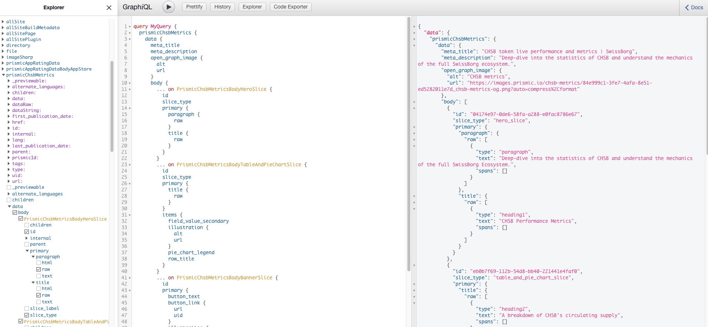

# Prismic & Gatsby.js Quick Start

## Step 1 
Install node on your machine from here https://nodejs.org/en/

## Step 2
Clone this repository into a folder of choice
```
git clone https://github.com/nbumbu/chsb-metrics.git
```

## Step 3
Use yarn (https://classic.yarnpkg.com/en/docs/install/) or npm to install all dependencies
```
yarn 
```
or
```
npm install
```

### Step 4
Start the develoment
```
gatsby develop
```

***

# Page markdown

The markdown and assets required for building the page is coming from the CMS (Prismic) and it's organized in slices (sections). 
It can be queried through Gatsby's GraphiQL data layer api (https://www.gatsbyjs.com/docs/graphql/).
The api can be accesed by typing http://localhost:8000/___graphql in the browser:




# API data

The data required for the page can be fetched from the following api root:
```
https://chsb-metrics-api.nbumbu.workers.dev/
```
The data required for the chsb chart can be fetched from the following api ends:
```
/chsb-price-all
```
```
/chsb-price-year
```
```
/chsb-price-month
```
```
/chsb-price-day
```
E.g. Request:
```
GET https://chsb-metrics-api.nbumbu.workers.dev/chsb-price-all
```
E.g. Response: 
```
[
    {
        "price": 0.00935,
        "time": "2019-06-16T00:00:00.000Z"
    },
    {
        "price": 0.008741,
        "time": "2019-06-17T00:00:00.000Z"
    },
    {
        "price": 0.008509,
        "time": "2019-06-18T00:00:00.000Z"
    }
]
```

The rest of the data can be found at the following api end:
```
/chsb-metrics
```
E.g. Request:
```
GET https://chsb-metrics-api.nbumbu.workers.dev/chsb-metrics    
```
E.g. Response: 
```
{
    "chsbCirculatingSupplyTokens": 227885076,
    "chsbStackedTokens": 139665000,
    "chsbStackedPercentage": 19.83,
    "chsbYieldPledgedTokens": 331754774,
    "chsbInYieldPercentage": 47.11,
    "chsbBurnedTokens": 4898917.07,
    "totalSupplyBurnedPercentage": 0.6956675457607038,
    "weeklyVolumeUSD": 259167353,
    "premiumUsersCount": 5280,
    "premiumUsersLastWeekCount": 83,
    "totalAumUSD": 1665087509,
    "chsbToBurnUSD": 1304601.02,
    "buyBackPercentage": 20,
    "chsbYieldUsersCount": 73603,
    "chsbYieldAPY": 10.5,
    "communityIndex": 9.3,
    "transactions": [
        {
            "dateTime": "2021-04-14T12:05:47+00:00",
            "chsbAmountTokens": 435240,
            "url": "https://etherscan.io/tx/0x4adf13d9edeb59f5f9c83a762e84afe8fb6174864059792809cd85ce2032a73f"
        },
    ]
}
```


## Learn more about using Prismic with Gatsby.js
> [Prismic + Gatsby.js Documentation](https://prismic.io/docs/technologies/gatsby)
## License

This software is licensed under the Apache 2 license, quoted below.

Copyright 2021 [Prismic](http://prismic.io/).

Licensed under the Apache License, Version 2.0 (the "License"); you may not use this project except in compliance with the License. You may obtain a copy of the License at http://www.apache.org/licenses/LICENSE-2.0.

Unless required by applicable law or agreed to in writing, software distributed under the License is distributed on an "AS IS" BASIS, WITHOUT WARRANTIES OR CONDITIONS OF ANY KIND, either express or implied. See the License for the specific language governing permissions and limitations under the License.
